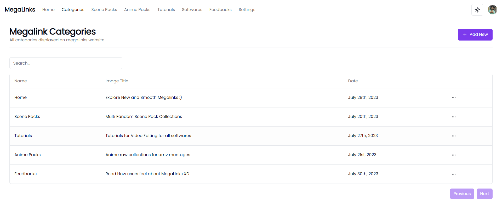
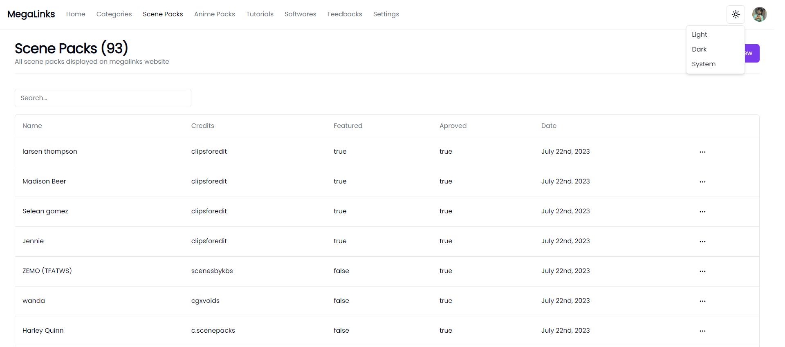
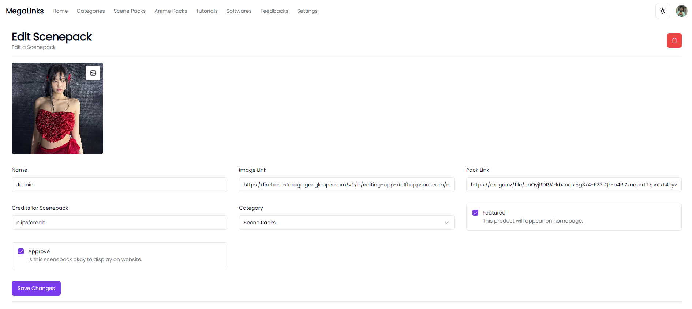
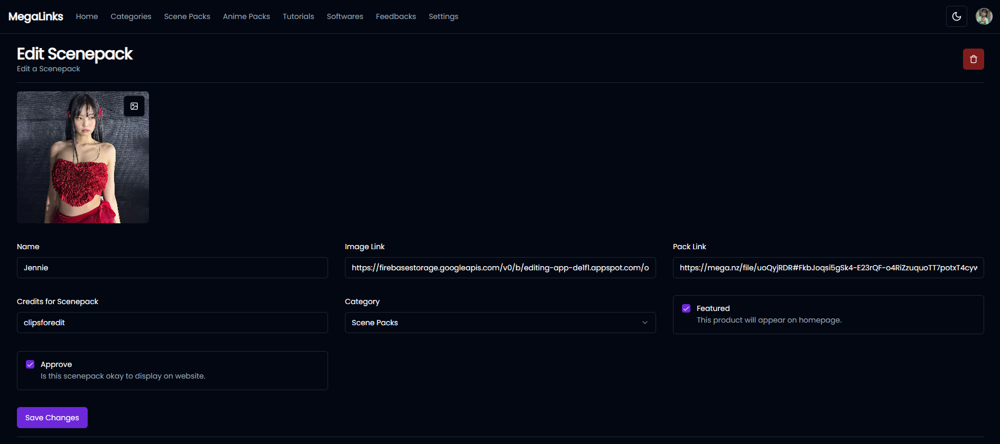
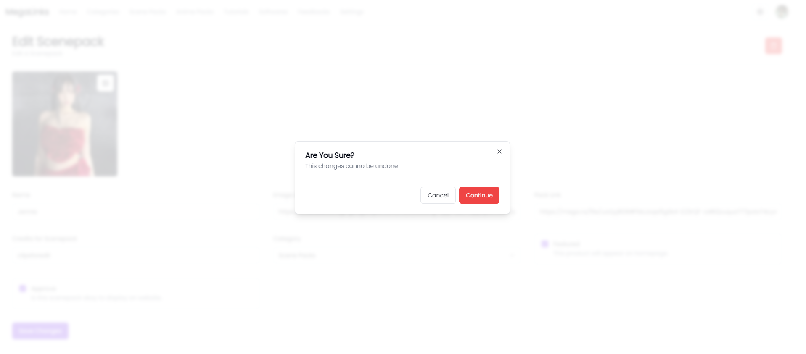
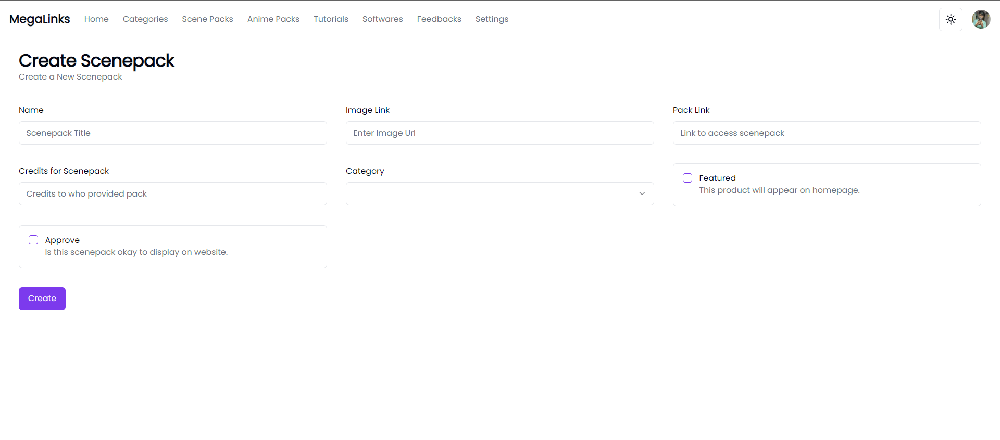
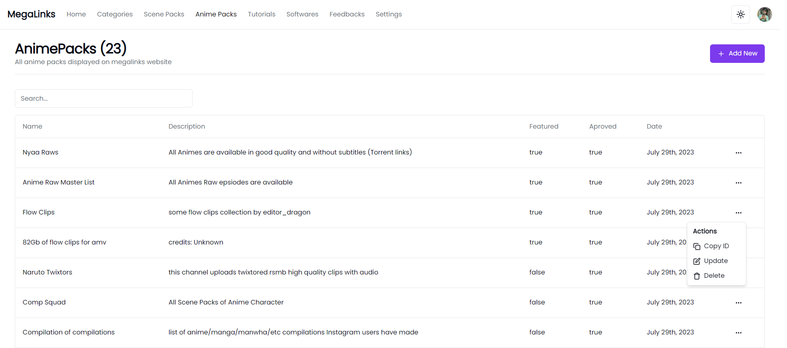
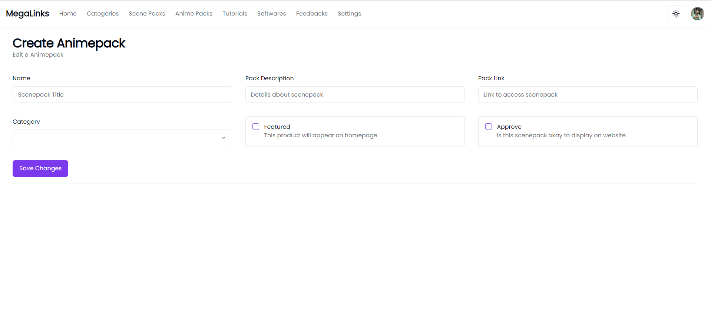
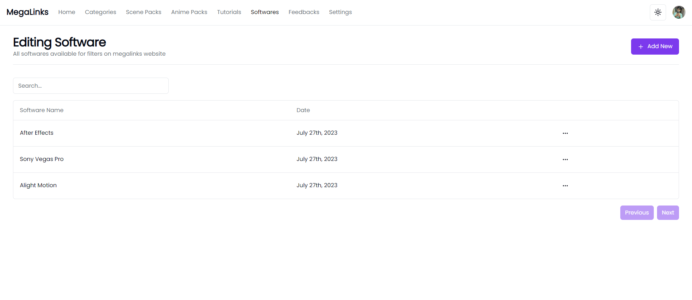

# megalinks-admin-portal
Admin portal for movies, anime scenepack sharing app

## Tech Stack
- Next JS
- Javascript
- Typescript
- Supabase
- Prisma
- Postgrace

# Screenshots

## Contact Me

    <a href="https://github.com/vishalrk1" target="_blank">
        &nbsp;
    </a>
    <a href="https://www.linkedin.com/in/vishal-karangale-126492216/" target="_blank">
        &nbsp;
    </a>
     <a href="https://www.instagram.com/vishal_rk1/" target="_blank">
       &nbsp;
    </a>

